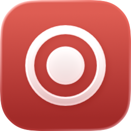

<h1 align="center">
  <picture>
    <source media="(prefers-color-scheme: dark)" srcset="docs/images/icon-dark.png">
    
  </picture>
  <br>
  Holdfast
</h1>

<p align="center">A meeting recorder for Macs that doesn't lose a track.</p>

<p align="center">
  <a href="https://github.com/maxim-golubev/holdfast/releases/latest"><b>Download for Apple Silicon</b></a> ·
  <a href="docs/guide.md">User guide</a> ·
  <a href="docs/architecture.md">Architecture</a> ·
  <a href="docs/validation.md">What was measured</a>
</p>

Holdfast lives in the menu bar: no Dock icon, and no window when it opens.
Start a recording from its menu, its panel, or a shortcut. Holdfast records the
screen, the sound the Mac plays, and your microphone. When you stop, it mixes
the sound sources into one audio track, so the whole meeting plays in any
player, and keeps the recording as written, with its tracks separate, next to
it.

- **Nothing goes silent:** the microphone keeps recording when the meeting app
  takes it, and follows AirPods as they come and go. In a six-minute test with
  two simulated calls, 18,063 of 18,063 microphone buffers were written.
- **The other side of the call is always there:** the sound the Mac plays comes
  from a Core Audio process tap, which hears FaceTime, and screen capture's
  system audio is recorded beside it as a backup. A tap that stops delivering
  is rebuilt within a second, and the backup fills the gap in the final file.
- **A crash costs seconds, not the meeting:** the file is written in
  10-second fragments. After a `kill -9` 35 s into a recording, the next launch
  found the file, recovered 30 s of it, and mixed it. Quitting during a
  recording waits for the file.
- **Built with:** Swift and SwiftUI, ScreenCaptureKit for picture and
  microphone, a Core Audio process tap for system audio, all on one clock, and
  AVFoundation for writing and mixing. No network requests, no updater, no
  account.

## Engineering

I started this after losing a meeting. In a 69-minute call recorded with
QuickRecorder 1.6.7, the microphone track was exact digital silence from 24 s
on, the moment the meeting app took the AirPods microphone. The other side of
the call was intact.

Most of the work went into six problems:

- **A call app silences the microphone.** QuickRecorder taps the microphone
  with AVAudioEngine. When another process opens the input with voice
  processing, as call apps do, the tap stops delivering and restarting the
  engine does not bring it back. A probe compared three ways of capturing while
  a second process held the microphone: the engine tap delivered 0 buffers;
  AVCaptureSession and ScreenCaptureKit's microphone output both kept
  delivering 50 buffers a second. Holdfast uses ScreenCaptureKit, which puts
  the microphone on the same clock as the picture and system audio.
- **The microphone changes format mid-recording.** AirPods deliver 24 kHz, the
  built-in microphone 48 kHz, and the format changes whenever the device does.
  AVAssetWriter plays audio buffers back to back and ignores gaps in their
  timestamps, so one missing buffer would shift everything after it. Every
  microphone buffer is converted to 48 kHz stereo and placed on one continuous
  timeline, and a hole is written as silence of the same length.
- **An MP4 that was never closed does not open.** The movie is written in
  10-second fragments, and the writer flushes a fragment only when every track
  has data for it. So a timer twice a second continues any track whose source
  has gone quiet: silence for audio, the last frame again for video (a static
  slide delivers no frames). A file left by a crash opens with up to about the
  last 12 seconds missing, and the next launch finds it, mixes it and names it.
- **The mix must never cost the recording.** The mix is written under a
  temporary name and checked before anything is renamed: one video and one
  audio track, the same length to within a second, and the microphone audible
  in the mix wherever it was alone in the recording. On any failure the
  two-track recording is what you get, with a report saying where it is.
- **System audio can die without a word.** In a 47-minute Zoom meeting in a
  browser, with AirPods, the process tap's aggregate device was clocked by the
  AirPods in their 24 kHz call mode, and its IOProc delivered nothing for the
  whole meeting; nothing in Core Audio said so. Measured since: a tap delivers
  the same whatever device clocks its aggregate device, the Mac's built-in
  output, none at all, or the AirPods. So Holdfast clocks it by the built-in
  output, rebuilds a tap that has delivered nothing for a second, in another
  way after two failures, for as long as the recording runs, and records
  screen capture's system audio beside it the whole time. The final file takes
  the tap's sound where the tap delivered and the backup's where it did not,
  switching where the tap stopped, never both at once.
- **A dead track must be seen during the meeting, a hiccup must not interrupt
  it.** No microphone audio for 5 seconds, only digital zeros for 20, or no
  system audio for 5 turns the menu bar item into a warning. Once the problem
  has lasted 15 seconds it is also shown in a small panel over every app (a
  full-screen meeting hides the menu bar, and macOS holds back notifications
  while the screen is shared) and posted as one notification; another when the
  audio is back. Routine events go to the log only.

One state machine owns each recording, with one way in and one way out, so a
stop pressed three times saves one recording once, and quitting waits for the
final file. 163 tests run in about a minute without the app, a screen, or
a microphone: they drive the real writer, converter, monitor, mixer and
recovery with synthetic buffers and check the files they write.

## Limits

- ScreenCaptureKit leaves out the audio of FaceTime calls and of phone calls
  taken on the Mac. Holdfast records system audio through a Core Audio process
  tap, which was checked to hear a FaceTime call, with screen capture's as a
  backup; a stretch in which the tap was dead has only the backup's sound,
  without FaceTime audio. Without the System Audio Recording permission it
  falls back to ScreenCaptureKit alone, says so, and call audio is missing.
- A file that was never closed (a crash, a kill, a power loss) misses up to
  about its last 12 seconds.
- Only the current save folder is searched for interrupted recordings.

More in the [user guide](docs/guide.md#known-limits).

## Install

Requires an Apple Silicon Mac on macOS 15 or later.

1. Download `Holdfast-<version>.zip` from
   [Releases](https://github.com/maxim-golubev/holdfast/releases/latest), unzip
   it, and move `Holdfast.app` to Applications.
2. Open it. The app is signed with the developer's certificate but not
   notarized by Apple, so macOS blocks the first launch: open **System Settings
   → Privacy & Security** and choose **Open Anyway**.
3. Allow Screen Recording when macOS asks, then open Holdfast again. It
   appears in the menu bar, not in the Dock. Choose **Open Main Panel** from
   its menu, turn on **Record Microphone** (it starts off), and allow the
   microphone when macOS asks. When the first recording starts, allow
   System Audio Recording too, so the other side of a call is recorded. A
   meeting recording needs all three permissions.

## Build from source

Requires Xcode 26 (the app icon is an Icon Composer document) and runs on macOS
15 or later. The project signs with its owner's development team, so
`Tools/build.sh` stops at code signing until you set your own team and bundle
identifier in Xcode.

```sh
Tools/build.sh      # Release build into build/, prints BUILD SUCCEEDED
Tools/test.sh       # the tests, about a minute, no app, screen or microphone
Tools/release.sh    # build/release/Holdfast-<version>.zip, signed and verified
```

## Credits

Holdfast is a modified version of
[QuickRecorder](https://github.com/lihaoyun6/QuickRecorder) by lihaoyun6, whose
recording engine began from [Azayaka](https://github.com/Mnpn/Azayaka) by Mnpn.
It is not an official QuickRecorder release. Global shortcuts use
[KeyboardShortcuts](https://github.com/sindresorhus/KeyboardShortcuts) by Sindre
Sorhus, and MP3 output [SwiftLAME](https://github.com/hidden-spectrum/SwiftLAME)
by Hidden Spectrum.

## License

[GNU AGPL-3.0](LICENSE), like QuickRecorder. Copyright © 2024 lihaoyun6;
modifications © 2026 Maxim Golubev.
